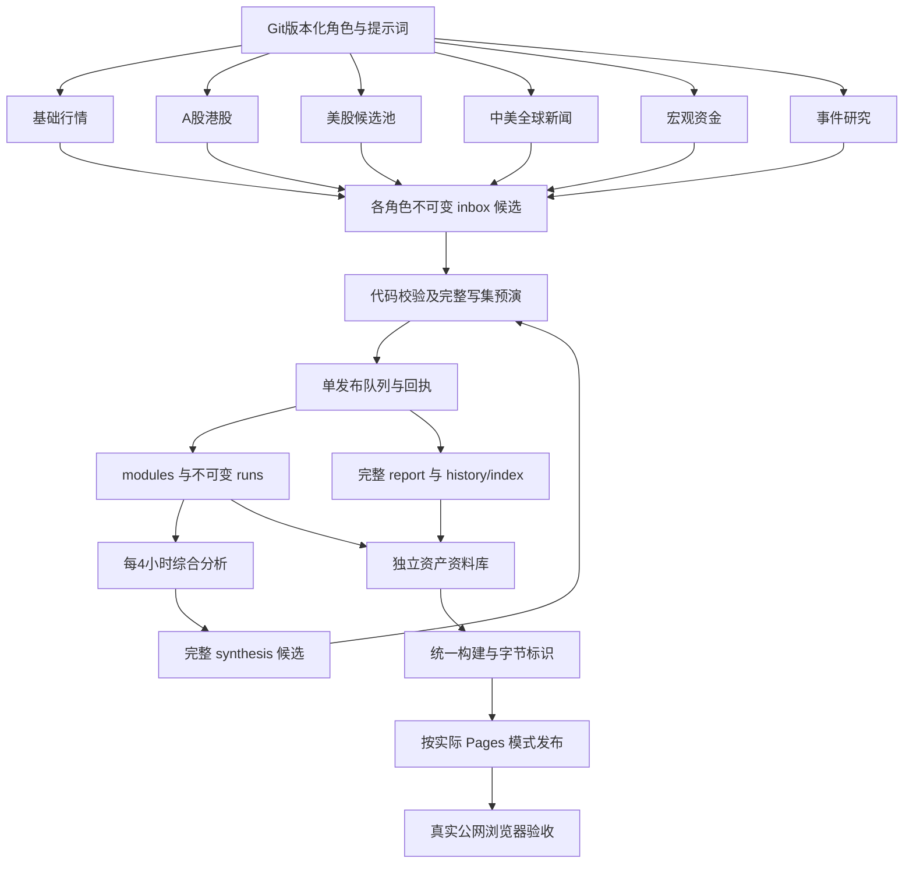

# GDR 架构设计 · 模块化个人市场情报台

## 目标与阅读层

首屏短、准；新闻、A–G、白话影响、多框架、24小时演化、资产详报完整保留，后置按兴趣展开。自选、板块样本和公司研究是独立资料库，不把全部股票堆到首屏。代码、配置、提示词、数据契约和调度备份随Git迁移，不依赖某个AI的记忆。

## 当前数据流（acceptance-r5 / candidate-gate-v1）

AI只能create本角色`data/inbox/<role>/<runId>.json`。manifest的`ownedPaths`是代码发布器最终所有权，不是AI直接改首页的权限。`submissionPaths`才是AI提交边界。只有synthesis候选的`payload.report`可发布全站报告，路径、编号、计划不能代替正文。

## 发布一致性

1. 校验候选身份、类型、引用和各角色内容；综合报告额外验证reader-r2全文、真实冻结run身份和时点。
2. 在隔离目录预演整个模块/报告/历史/索引写集。完整报告失败不得先污染synthesis指针。
3. 本地互斥下应用写集及回执；遇可捕获IO异常恢复之前字节。进程被强杀或跨机器故障不等于有数据库事务保证。
4. 正式数据与构建标识在一个Git提交中公开。非快进冲突从最新main重新计算，最多五次，不强推，不拿旧快照rebase覆盖新数据。
5. 确切冻结依赖尚未到达可标`waiting-dependencies`，后续队列触发有界重试；错误候选`rejected`，不修改已接受回执。其他合格候选继续处理。
6. 回执`published`是仓库正式发布，`archived-older`仅归档，不能叫首页更新。还要区分网页是否部署及是否实测。

## 文件与职责

| 路径 | 职责 |
|---|---|
| automation/manifest.json | 七角色、常驻时区/RRULE、依赖、提交及发布边界 |
| automation/prompts/common.md | 共用真实性、时间、候选协议 |
| automation/prompts/*.md | 角色具体任务 |
| automation/task-export.json | 从manifest与入口编译器生成的恢复入口 |
| automation/bindings.json | 当前账户任务ID、入口哈希、调度核对；不能跨账户复制ID |
| automation/acceptance-r5.json | 用户要求的一次性复跑批次，与常驻调度分开 |
| config/watchlist.json | 必看资产、N、行业目录、US候选池、预算 |
| data/inbox / data/receipts | 未受信任候选及代码处理回执 |
| data/modules / data/runs | 正式模块指针及不可变版本 |
| data/latest.json / history / history-index | 完整综合报告与历史 |
| lib/publication.cjs | 预演写集、失败回滚、冻结依赖、回执 |
| lib/pipeline.cjs | 本地互斥、缓存、归档、报告发布、入口编译 |
| scripts/run-agent.cjs | 任意AI stdin/stdout适配，仍通过候选发布门禁 |
| scripts/stage-site.cjs | 同一公共站点构建、文件哈希和buildId |
| tests/ui-real-data.cjs | 真实源文件或真实公网交互；离线模式明确标记 |
| scripts/check-acceptance.cjs | 七个原生复跑回执、run哈希和综合冻结输入检查 |

## Pages部署模式必须核实

2026-09-22验收实际读取到本仓库Pages为`legacy`、`main`根目录，而不是假定的`workflow`模式。发布工作流先查询实际配置：legacy模式请求原有分支构建；workflow模式才上传和部署Actions artifact。不能两个路径竞争发布，也不能在无Administration权限时声称改过仓库设置。

`data/build.json`随正式产物持久化。`buildId`和`files`哈希描述真实公共字节；`commit`记录构建时的源上下文，可能早于随后保存构建标识的提交。不要把它误当自引用的最终commit。公开版本准备就绪使用有界轮询，再检查真实URL的各文件哈希及浏览器功能；一次deploy接口成功不是最终验收。

分支模式下源码push仍可触发原生构建，仓库管理员可选择GitHub Actions作为长期唯一发布源。代码门禁约束候选到正式数据的路径，不是托管平台权限的替代品。公开仓库中不要放任何服务凭据。

## 三种时钟与旧数据

综合report.updatedAt、模块generatedAt、报价asOf/研究analyzedAt分别表示报告版本、模块生成、真实材料时点。缺时点不编午夜/收盘；旧研究和休市前收可以继续有用，但不是实时。新模块读取失败保留上一合格显示并提示失败，不把旧数盖当下时间。跨模块同一证券比较时点和数值有效性，空值或较旧股票行不能覆盖较新的有效报价。

## 榜单与研究边界

热度用同组量比/换手/成交额分位；弱势用同组相对涨跌幅。默认N=5，可调1–20。热不等于看涨，弱不等于差公司，样本池不等于全行业。无授权成员库与同口径批量行情就如实给样本及缺口，不凭新闻拼一个全市场榜。

科技候选池与上市投资控股/资管/另类资管/券商池是可配置观察名单。研究关注收入、盈利、现金流或AUM/FRE/募资退出；相同eventKey原材料身份不能变，复用保留analyzedAt，新文档/版本单独入队。旧估值保留valuationAsOf，每轮预算最多5家，pending不能写成已完成。

## 验收与限制

七个常驻角色保持职责划分。用户要求的复跑使用相同契约的一次性原生任务副本，根execution记录batchId/mode/role；不是把旧数据改日期。综合复跑须冻结六个本批次输入。

验收分别看配置一致、实际执行、accepted receipt、数据覆盖、真实页面。程序通过只能证明所测结构/交互和字节一致，不认证每条新闻真实，也不保证未来无故障。各市场最新数据是否齐全与网页是否可用是两项结果。全行业行情仍需授权数据，分钟级实时仍需独立采集服务；7职责拆分不保证更省额度。

不预建复杂微服务。先让可观测的采集、可审计证据、确定性门禁和可复现网页验收稳定运行，再按真实负载引入队列/数据库。
