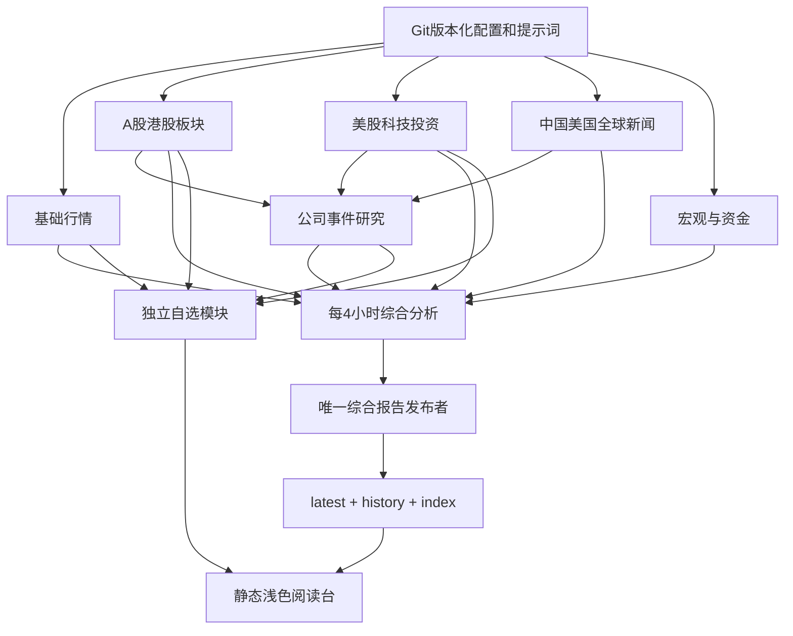

# GDR 架构设计 · 模块化个人市场情报台

## 目标

首屏仍然短、准；新闻、A–G、白话影响、多框架、24h、资产详报全部保留。新增自选不是把几百只股票塞在首屏，而是一个独立可展开资料库。系统尽量不依赖某个AI的聊天记忆、特定模型、会话ID或专有数据库。

## 数据流

一个角色只拥有一个模块，角色输出是JSON而不是继续向下一个模型喊口号。综合分析每4小时仍运行；开盘/收盘角色不再竞争同一个latest。独立模块可在09:35/16:35更新行情榜单，综合报告时间不被假刷新。单一发布者是**逻辑角色**，本地脚本有进程锁；ChatGPT连接器模式仍依赖SHA检查和角色边界，不声称有跨平台分布式锁。

## 文件与职责

| 文件 | 职责 |
|---|---|
| automation/manifest.json | 角色、schedule、时区、读写所有权、UI模块映射 |
| automation/prompts/common.md | 共用真实性/时间/发布底线 |
| automation/prompts/*.md | 七种具体职责，每个可单独替换 |
| automation/task-export.json | 由manifest生成的可恢复任务入口，避免聊天里唯一备份 |
| automation/bindings.json | 当前平台任务ID映射；迁移时不复制ID |
| config/watchlist.json | 必看资产、N、行业目录、US候选池、流动性阈值 |
| data/modules/*.json | 各角色最近一次完整结果/状态 |
| data/runs/<role>/*.json | 不可变版本，历史依赖冻结 |
| data/latest.json + history/ | 兼容原schema5的完整研究报告 |
| assets/watchlist-core.js | 数据验证、热度/弱势排序、研究缓存辅助，Node/浏览器共用 |
| assets/watchlist.js/css | 自选、榜单、研究、模块状态；不改主报告阅读逻辑 |
| lib/pipeline.cjs | 文件发布、互斥、幂等、旧版本防覆盖、编译提示词 |
| scripts/run-agent.cjs | 任意AI的stdin/stdout JSON执行器接口 |

## 三种时钟

报告updatedAt：综合判断的截止版本。模块generatedAt：某职责的运行产物。每条报价asOf/研究analyzedAt：实际信息时点。三者不混。模块TTL是运营告警阈值，休市报价可以有效但不是实时；研究可长期沿用也不等于当前估值有效。

## 榜单的数据边界

热度并非涨幅；弱势并非烂公司。量比、换手、成交额同组分位，弱势同板块相对涨跌幅。默认N=5，支持调N。公开搜索不等于可获得5000只股票的整齐快照：无批量源时只能输出样本榜及覆盖缺口。行情与行业成分接口的授权、速率和费用是独立依赖，不由Pro订阅自动提供。

投资公司候选池是上市控股、资管、私募/另类资管和券商。财报关注AUM/FRE/募资退出，与科技公司的增长/利润率/现金转化分开。所有名单是配置，不是当前热股结论。

## 事件研究缓存

检查新材料身份 → 与eventKey集合比对 → 相同事件复用原分析日期 → 新文档/版本入待办 → 预算内研究 → 新记录追加 → 综合报告引用。待办不能被“未发现新事件”掩盖。解析失败保留旧研究，显示新事件待研究。只有新股价时不重写整份季度财报分析，但估值时点需要独立更新。

## 可靠性与已知边界

- 本地runId幂等、不可变档案、旧结果不回退，只有综合角色发布完整report。
- 多模块不同时间更新，综合报告显式冻结所用run，历史页拒绝混用未来模块。
- 未取得数据展示缺失，不造首轮行情/财报/热股；新UI具备功能不等于所有外部数据源已接入。
- 任务错峰是尽力调度，不是强DAG。慢任务不阻塞所有其他市场；下一综合版吸收晚到产物。
- 7个独立职责比3条巨型任务更可维护，但触发次数更多，**不保证更省Token或额度**。研究用事件去重和每轮预算控制成本。
- 定时任务runtime是否有联网、GitHub写、执行器能力由平台和授权决定。复制prompt不能复制权限。
- CI为结构/算法回归，不认证行情与新闻真假。当前仓库未附专有完整行情源，未部署分钟级采集服务。

## 扩展路线

先用模块化快照和真实样本。需要全量行业榜时接授权批量行情适配器，让程序选出候选，再让LLM解释变化；不要把几千行原始行情先塞进模型。需要分钟级走势时单独部署采集服务和时序存储，研究仍低频。只有真遇到规模瓶颈再引入数据库/队列，不为七个模块提前搭微服务集群。
